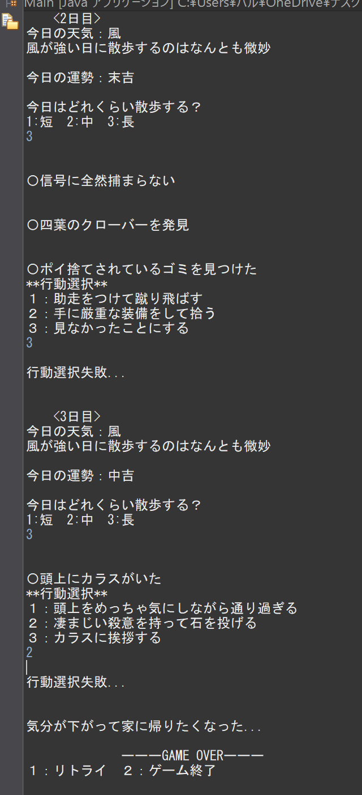
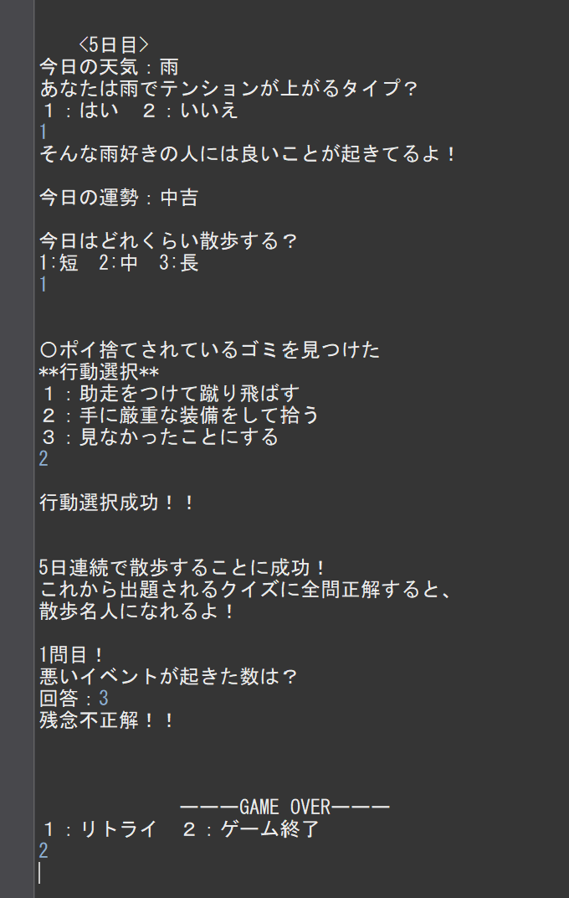

# さんぽ道（散歩シミュレーションゲーム）

## 概要
Javaを使用して制作したコンソール型の散歩シミュレーションゲームです。  
プレイヤーは散歩中に発生する様々なイベントに対応しながら、5日間の散歩を成功させて「散歩名人」になることを目指します。  
ゲーム中にはランダムイベントが発生し、行動選択によってプレイヤーの気分（HP）が変化します。  
気分（HP）が0になるとゲームオーバーになります。  
5日間の散歩に成功すると、これまでの散歩中に起きた出来事に関するクイズに挑戦できます。    
クイズ（全3問）にすべて正解するとゲームクリアになります。

## ゲーム画面
| ゲーム画面1                                      | ゲーム画面2                       | ゲーム画面3                          |
| ----------------------------------------- | ---------------------------------- | ---------------------------------------- |
|  |  |  |

| ゲームオーバー1                         | ゲームオーバー2                       |
| ----------------------------------------- | ---------------------------------- |
|  |  |

## 使用技術
Java

## ゲームの流れ
1. Enterを押してゲームスタート
2. 散歩する季節を数字入力で選択（1:春 2:夏 3:秋 4:冬）
3. 散歩の長さを数字入力で選択（1:短 2:中 3:長）
4. プレイヤーの行動選択（1～3で選択）
5. 全3問のクイズに挑戦（数字で回答）
6. 全問正解でゲームクリア

## 主な機能
 - プレイヤーの行動選択
 - ランダムイベントの発生
 - 気分（HP）の管理
 - 5日間のゲーム進行
 - 季節に応じたイベントの変化
 - 散歩イベントに関するクイズ機能

## 工夫した点
 - ランダム要素を多くし、何回でも楽しめるようにしました。
 - 季節（春・夏・秋・冬）によってイベント内容が変わるように設計しました。
 - 散歩中に発生したイベントを覚えておき、ゲーム終盤のクイズに出題する仕組みを作りました。
 - コンソールゲームでも遊びやすいように、メッセージ表示や選択肢の分かりやすさを意識しました。

## 実行方法
Mainクラスを実行してください。

## 制作人数
1人

## 制作時期
1年後期に制作

## 制作期間
授業での最終課題として制作  
28.5時間（19コマ）
